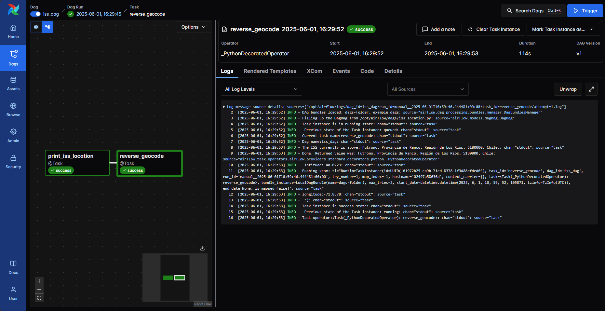
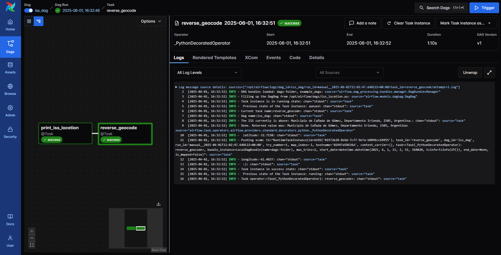

# Airflow-Mini-Project
Learning the fundamentals of Apache Airflow through a hands-on mini-project. 

## Airflow set up steps - using docker
### 1. Download Docker Compose YAML

```bash
curl -O https://airflow.apache.org/docs/apache-airflow/3.0.0/docker-compose.yaml
```
### 2. Create Required Folders
dags, plugins, logs.


These folders are mounted into the Airflow containers and are necessary for DAG storage, logging, and optional plugins.

### 3. Create a .env File
Create a .env file in the root directory of your project with the AIRFLOW_UID AND AIRFLOW_GID 
These additional variables are useful in case you are trying out/testing Airflow installation via docker compose. They are not intended to be used in production, but they make the environment faster to bootstrap for first time users with the most common customizations.
(source: https://airflow.apache.org/docs/apache-airflow/2.1.1/start/docker.html#:~:text=Environment%20variables%20supported%20by%20Docker%20Compose,-Do%20not%20confuse&text=Airflow%20Image%20to%20use.&text=Group%20ID%20in%20Airflow%20containers,must%20be%20set%20to%200%20.&text=Those%20additional%20variables%20are%20useful,with%20the%20most%20common%20customizations.&text=Username%20for%20the%20administrator%20UI,container%20with%20embedded%20development%20database.&text=Password%20for%20the%20administrator%20UI,Only%20used%20when%20_AIRFLOW_WWW_USER_USERNAME%20set.&text=If%20not%20empty%2C%20airflow%20containers,1%20and%20above.)

### 4. Initialize Airflow
```bash
docker-compose up airflow-init
```
This sets up the Airflow metadata database and initializes other services like Redis and PostgreSQL.

### 5. Start Airflow
```bash
docker-compose up
```
To check if the services are running:
```bash
docker ps
```
### 6. Access Airflow Web UI
```bash
http://localhost:8080
```
Login with:
Username: airflow
Password: airflow

### 7. Create DAGs in dags folder and check dag runs in the airflow UI
---
# DAGs Implemented in this repository
## 1. Demo DAG 1: Traditional Python + Bash Operator Style

This DAG:

* Simulates training 3 models in parallel.
* Randomly generates an accuracy score for each.
* Uses BranchPythonOperator to pick the best model.
* Branches to either "accurate" or "inaccurate" based on the score.

### Key Concepts

* PythonOperator: Executes Python functions for training models.
* BranchPythonOperator: Decides the next task based on logic.
* BashOperator: Prints the result.
* XCom: Used to pass values between tasks.

### Task Dependency

```python
[training_model_A, training_model_B, training_model_C] >> choose_best_model >> [accurate, inaccurate]
```

### UI Output:


#### Reference- https://www.youtube.com/watch?v=IH1-0hwFZRQ
---

## 2. Demo DAG 2 - using decorators

A cleaner, more modern DAG using Airflow's @dag and @task decorators.

* Training tasks use @task.
* Branching logic uses @task.branch.
* BashOperators are still used for final outputs.
* XCom is handled automatically via return values.

### Why TaskFlow?

* Simpler syntax.
* Better readability.
* Automatic XCom handling.
* Encouraged by the Airflow community for new DAGs.

### UI Output-
Same output as above, but cleaner code


---

## Resources

* TaskFlow tutorial: [https://airflow.apache.org/docs/apache-airflow/stable/tutorial/taskflow.html](https://airflow.apache.org/docs/apache-airflow/stable/tutorial/taskflow.html)
* XComs in Airflow: [https://airflow.apache.org/docs/apache-airflow/stable/core-concepts/xcoms.html](https://airflow.apache.org/docs/apache-airflow/stable/core-concepts/xcoms.html)

---
# Mini-Project: ISS Location API DAG
This mini-project is a personal learning initiative to practice using Apache Airflow and working with external APIs. It fetches real-time location data from the International Space Station (ISS) and uses reverse geocoding to identify the nearest location on Earth.
* Data Source: Open Notify ISS API- http://api.open-notify.org/iss-now.json
* Reverse Geocoding: Nominatim OpenStreetMap API- https://nominatim.org/release-docs/latest/api/Reverse/


DAG Tasks-
1. load ISS(International Space Station) location
2. Use OpenStreetMaps API to reverese geocode the address of the location
3. Insert the coordinates and the address into a database (OracleSQL)

Another DAG added that- copies the data from that table to another log table

Sample output of Airflow UI- 




sample output:


Log message source details: sources=["/opt/airflow/logs/dag_id=iss_dag/run_id=manual__2025-06-01T11:02:47.640122+00:00/task_id=reverse_geocode/attempt=1.log"]
[2025-06-01, 16:32:52] INFO - DAG bundles loaded: dags-folder, example_dags: source="airflow.dag_processing.bundles.manager.DagBundlesManager"
[2025-06-01, 16:32:52] INFO - Filling up the DagBag from /opt/airflow/dags/iss_location.py: source="airflow.models.dagbag.DagBag"
[2025-06-01, 16:32:52] INFO - Task instance is in running state: chan="stdout": source="task"
[2025-06-01, 16:32:52] INFO -  Previous state of the Task instance: queued: chan="stdout": source="task"
[2025-06-01, 16:32:52] INFO - Current task name:reverse_geocode: chan="stdout": source="task"
[2025-06-01, 16:32:52] INFO - Dag name:iss_dag: chan="stdout": source="task"
[2025-06-01, 16:32:52] INFO - The ISS currently is above: Municipio de Cañada de Gómez, Departamento Iriondo, 2505, Argentina.: chan="stdout": source="task"
[2025-06-01, 16:32:52] INFO - Done. Returned value was: Municipio de Cañada de Gómez, Departamento Iriondo, 2505, Argentina: source="airflow.task.operators.airflow.providers.standard.decorators.python._PythonDecoratedOperator"
[2025-06-01, 16:32:52] INFO -  latitude:-32.7150: chan="stdout": source="task"
[2025-06-01, 16:32:52] INFO - Pushing xcom: ti="RuntimeTaskInstance(id=UUID('01972b28-8e6d-7cf7-9e7a-b8096cc64955'), task_id='reverse_geocode', dag_id='iss_dag', run_id='manual__2025-06-01T11:02:47.640122+00:00', try_number=1, map_index=-1, hostname='02497a58636d', context_carrier={}, task=<Task(_PythonDecoratedOperator): reverse_geocode>, bundle_instance=LocalDagBundle(name=dags-folder), max_tries=2, start_date=datetime.datetime(2025, 6, 1, 11, 2, 51, 568020, tzinfo=TzInfo(UTC)), end_date=None, is_mapped=False)": source="task"
[2025-06-01, 16:32:52] INFO - longitude:-61.4837: chan="stdout": source="task"
[2025-06-01, 16:32:52] INFO -  :): chan="stdout": source="task"
[2025-06-01, 16:32:52] INFO - Task instance in success state: chan="stdout": source="task"
[2025-06-01, 16:32:52] INFO -  Previous state of the Task instance: running: chan="stdout": source="task"
[2025-06-01, 16:32:52] INFO - Task operator:<Task(_PythonDecoratedOperator): reverse_geocode>: chan="stdout": source="task"

## Oracle DB integration for logging real-time ISS location data into a relational database. Two DAGs are used:

### 1. `iss_dag`: API → Geocode → Oracle Insert (Python)

- Fetches ISS location using [Open Notify API](http://api.open-notify.org/iss-now.json)
- Uses [Nominatim API](https://nominatim.org/release-docs/latest/api/Reverse/) for reverse geocoding
- Inserts data directly into Oracle using the `oracledb` Python client
- Fully written using TaskFlow API (`@task`)

### 2. `iss_log_dag`: OracleOperator (PL/SQL)

- Calls a stored PL/SQL procedure (`copy_new_data`) that copies rows from a source table to a target table
- Uses Airflow's `OracleOperator`

---
